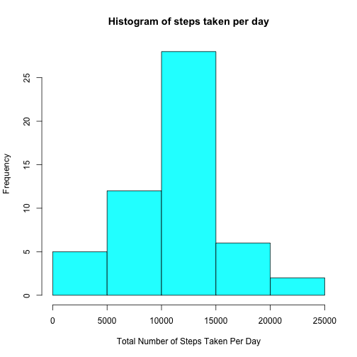
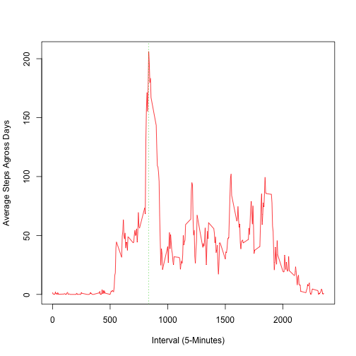
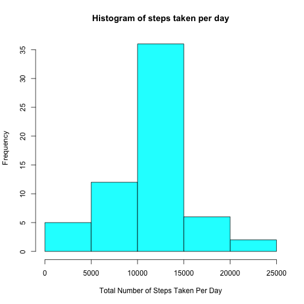
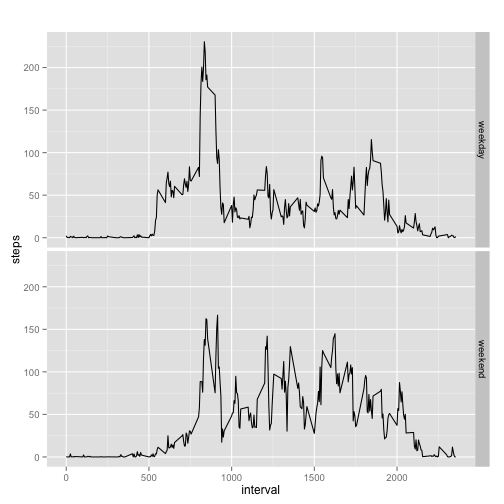

### Reproducible Research Coursework
<p>======================================================</p>

#### Loading and preprocessing the data

```r
require("plyr")

activity.data <- read.csv(unz("activity.zip", "activity.csv"))
comp.activity.data <- activity.data[complete.cases(activity.data),]
```


#### What is mean total number of steps taken per day?


```r
data.by.day <- ddply(comp.activity.data, 
                     .(date),
                     summarize,
                     steps = sum(steps))

hist(data.by.day$steps,
     main = "Histogram of steps taken per day",
     xlab = "Total Number of Steps Taken Per Day",
     col = "cyan"
     )
```

 

```r
mean.activity <- mean(data.by.day$steps)
median.activity <- median(data.by.day$steps)
print(paste("Mean steps: ", mean.activity))
```

```
## [1] "Mean steps:  10766.1886792453"
```

```r
print(paste("Median steps: ", median.activity))
```

```
## [1] "Median steps:  10765"
```

#### What is the average daily activity pattern?

```r
## Time series plot
data.by.interval<- ddply(comp.activity.data, 
                         .(interval),
                         summarize,
                         steps = mean(steps))

plot(x = data.by.interval$interval,
     y = data.by.interval$steps,
     xlab = "Interval (5-Minutes)",
     ylab = "Average Steps Agross Days",
     type = "l",
     col = "red")

## Find the maximum 5-minute interval
ordered.data <- data.by.interval[order(data.by.interval[,2],decreasing =TRUE),]
print(paste("Interval with Maximum steps: ",ordered.data[1,1]))
```

```
## [1] "Interval with Maximum steps:  835"
```

```r
##Plot the line on the plot that has maximum steps 
abline(v=835,col=3,lty=3)
```

 


#### Imputing missing values
<p> For imputing, i am using mean value of each interval </p>


```r
rows.with.nas <- nrow(activity.data) - nrow(comp.activity.data)
print(paste("Total NAs: ",rows.with.nas))
```

```
## [1] "Total NAs:  2304"
```

```r
data.with.nas <- subset(activity.data, is.na(activity.data$steps))

imputed.data <- merge(data.with.nas, data.by.interval, by = "interval")
names(imputed.data)[4] <- "steps"

##create new data frame with NAs imputed with means of 5-minute intervals
new.data <- rbind(imputed.data[,c(1,3,4)], comp.activity.data)

##draw histogram
new.data.by.day <- ddply(new.data, 
                         .(date),
                         summarize,
                         steps = sum(steps))
hist(new.data.by.day$steps,
     main = "Histogram of steps taken per day",
     xlab = "Total Number of Steps Taken Per Day",
     col = "cyan"
     )
```

 

```r
mean.activity <- mean(new.data.by.day$steps)
median.activity <- median(new.data.by.day$steps)
print(paste("Mean steps: ", mean.activity))
```

```
## [1] "Mean steps:  10766.1886792453"
```

```r
print(paste("Median steps: ", median.activity))
```

```
## [1] "Median steps:  10766.1886792453"
```
<p> Once we impute the NAs, still we get same mean value, but slightly different median value (median = mean). We didn't get much more difference after imputing the NAs. From the histogram we can see almost same interpretation for both ways. </p>

#### Are there differences in activity patterns between weekdays and weekends?

```r
library("ggplot2")

date.list <- as.Date(new.data[,2])

day.factor1 <- gsub(x = weekdays(date.list), fixed = TRUE, pattern = "Sunday", replacement = "weekend")
day.factor2 <- gsub(x = day.factor1, fixed = TRUE, pattern = "Saturday", replacement = "weekend")

day.factor2[day.factor2!="weekend"] <- "weekday"
final.data <- cbind(new.data, day.factor = day.factor2)

final.data.interval<- ddply(final.data, 
                         .(interval),
                         summarize,
                         steps = mean(steps))


# plot the data for each city and save as png
#png("plot.png")

g <- ggplot(final.data)
p <- g + stat_summary(aes(x=interval,y=steps),fun.y=mean, geom = "line")  + facet_grid(day.factor~.) +
  labs(title="")

print(p)
```

 

```r
# shutdown the png device
#dev.off()
```
